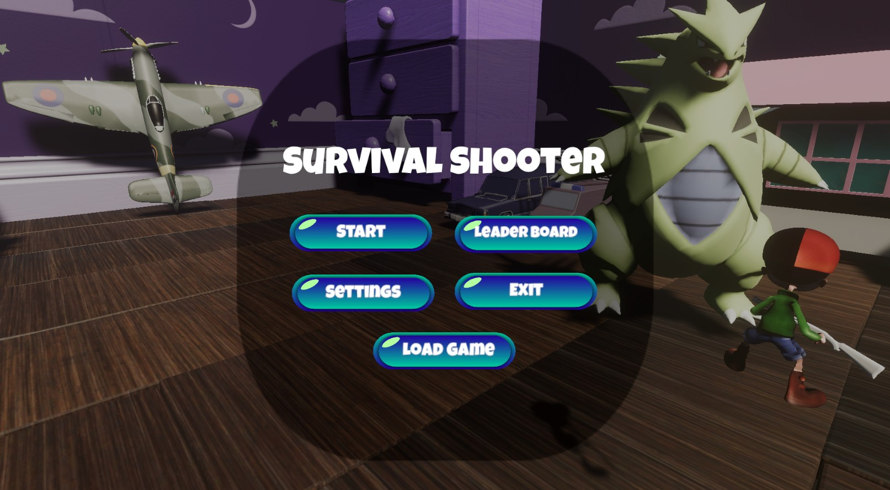

# IF3210-2023-Unity-AXF

## Description
Survival Shooter is a third-person game that challenges the player to survive against increasing waves of enemies in multiple levels as quick as possible. The game is set in a room belonging to a boy named Timmy, who is abandoned by his parents in the middle of the night. As the night progresses, Timmy's toys come to life and attack him, forcing him to defend himself with the weapons he has available.  

Various types of enemies are featured in the game, ranging from basic zombies to big bosses, each with their level of difficulty. As the level increases, the enemies become more difficult to defeat, so the player must strategize by using different weapons, obtaining a pet to assist them, and upgrading their weapon's damage. The player can even resort to cheats to improve their chances of survival.

## Used Libraries
1. UnityEngine
2. System
3. HDRP

## Screenshot

## Pembagian Kerja
| NIM  | Name | Tasks |
| ------------- | ------------- | ------------- |
| 13520008 | Daniel Salim  | Quests, Open & Ending Scenes
| 13520045  | Addin Nabilal Huda  | Weapon, Cheat pt.1, Setup Project
| 13520057 | Marcellus Michael Herman K | Setting, Shopkeeper, Cheat pt.2, Setup Asset, Upgrade Weapon
| 13520092 | Vieri Mansyl | Pet, Setup Project
| 13520137 | Muhammad Gilang Ramadhan | Scoreboard, Save & Load, Game State, Setting, Upgrade Weapon

## Estimated Hours Used for Preparation & Work
| NIM  | Nama | Estimated Hours |
| ------------- | ------------- | ------------- |
| 13520008 | Daniel Salim  | 50 |
| 13520045  | Addin Nabilal Huda  | 50 |
| 13520057 | Marcellus Michael Herman K | 50 |
| 13520092 | Vieri Mansyl | 50 |
| 13520137 | Muhammad Gilang Ramadhan | 50 |
